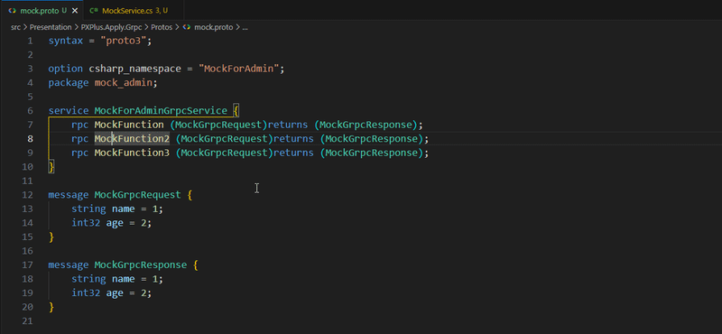

# Proto Navigation

> 🚀 Navigate seamlessly from `.proto` files to C# and Python service implementations



## ✨ Features

### 🎯 Smart Navigation
- **Go to Definition** (`F12`) — Navigate to message definitions or service implementations
- **Go to Implementation** (`Cmd/Ctrl+F12`) — Jump to service methods or message definitions
- **Peek Definition** (`Alt/Option+F12`) — Preview implementations without leaving your file

For **Request/Response** message types, both `F12` and `Cmd/Ctrl+F12` navigate to the message definition within the proto file. For **service methods**, they navigate to the C# or Python implementation.

### 🔍 Intelligent Search
- **Automatic Discovery** — Finds `*Service.cs` and `*Service.py` files in your project
- **Multi-Language Support** — Works with both C# and Python implementations
- **Configurable Paths** — Customize where to search for implementation files
- **Manual Override** — Use `service_file` directives when needed

### 📊 Developer-Friendly
- **Detailed Logging** — Track navigation and search progress in the Output panel
- **Smart Caching** — Fast subsequent navigations with intelligent caching
- **Zero Configuration** — Works out of the box with standard project structures

---

## 🚀 Quick Start

### 1️⃣ Installation

Install the extension from the VS Code Marketplace. The extension includes built-in syntax highlighting for `.proto` files.

> 💡 **Migrating from v0.1.x?** Version 0.2.0+ includes independent syntax highlighting and no longer requires the `DrBlury.protobuf-vsc` extension.

### 2️⃣ Basic Usage

**Option A: Zero Configuration (Recommended)**

If your project follows this structure, it just works:
```
project/
├── Protos/
│   └── user.proto
└── Services/
    ├── UserService.cs
    └── PaymentService.py
```

**Option B: Custom Configuration**

Press `F1` and run:
```
ProtoNavigation: Set Implementation Root Directory
```

Choose your implementation folder (e.g., `src/services/`) and save to User or Workspace settings.

**Option C: Per-File Override**

Add a directive in your `.proto` file:
```proto
// service_file = "Services/UserService";
```

### 3️⃣ Start Navigating!

| Keyboard Shortcut | Action | What It Does |
|---|---|---|
| `F12` | Go to Definition | Jump to message definition in proto file, or service implementation in C#/Python |
| `Cmd/Ctrl+F12` | Go to Implementation | For Request/Response: jump to proto definition; for methods: jump to C#/Python implementation |
| `Alt/Option+F12` | Peek Definition | Quick preview in a popup window |

---

## ⚙️ Configuration

### Settings

| Setting | Default | Description |
|---------|---------|-------------|
| `protoNavigation.implementationRootDirectory` | `Services/` | Root directory for implementation files (relative to proto parent directory) |

**Example values:**
- `Services/` → searches `../Services/` relative to proto file
- `src/services/` → searches `../src/services/` relative to proto file
- `backend/grpc/` → searches `../backend/grpc/` relative to proto file

### Commands

Access via `F1` or `Cmd/Ctrl+Shift+P`:

| Command | Description |
|---------|-------------|
| **ProtoNavigation: Set Proto Service File** | Insert a `service_file` directive template in current file |
| **ProtoNavigation: Set Implementation Root Directory** | Configure implementation search path (User or Workspace) |

---

## 🔧 How It Works

### Search Priority

The extension resolves implementations in this order:

1. **📌 Proto file directive** (highest priority)
   ```proto
   // service_file = "Services/BillService";
   ```

2. **⚙️ User/Workspace configuration**
   - Value from `protoNavigation.implementationRootDirectory`

3. **📁 Default fallback**
   - Searches `Services/` directory

### Language Support

| Language | File Pattern | Method Pattern |
|----------|--------------|----------------|
| **C#** | `*Service.cs` | `\b{MethodName}\s*\(` |
| **Python** | `*Service.py` | `\bdef\s+{MethodName}\s*\(` |

---

## 🐛 Troubleshooting

### Not finding implementations?

1. **Check logs**: Open Output panel (`Cmd/Ctrl+Shift+U`) → Select **"Proto Navigation"**
2. **Verify structure**: Ensure implementation files follow `*Service.{cs,py}` naming
3. **Configure path**: Use `ProtoNavigation: Set Implementation Root Directory` if using non-standard structure

### Slow navigation?

If your `.proto` imports external files (e.g., `google/protobuf/empty.proto`), navigation may be slower due to dependency resolution.

---

## 🏗️ Architecture

For developers interested in extending or understanding the codebase:

| Module | Purpose |
|--------|---------|
| `extension.ts` | Extension entry point and provider registration |
| `providers/definitionProvider.ts` | Definition and Implementation provider logic |
| `services/protoParser.ts` | Proto directive parsing and message type detection |
| `services/serviceFileResolver.ts` | Implementation file search and resolution |
| `cache/cacheManager.ts` | Document and path caching |

---

## 📝 License

See [LICENSE.md](LICENSE.md)

## 🔗 Links

- [GitHub Repository](https://github.com/YTingWu/proto-navigation)
- [VS Code Marketplace](https://marketplace.visualstudio.com/items?itemName=BruceWu.proto-navigation)
- [Report Issues](https://github.com/YTingWu/proto-navigation/issues)
